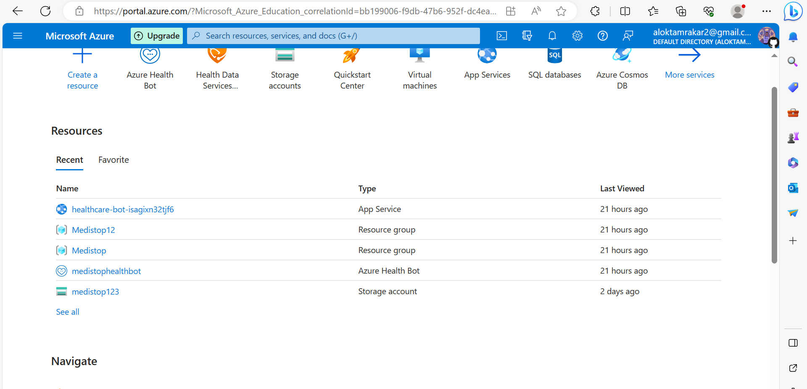
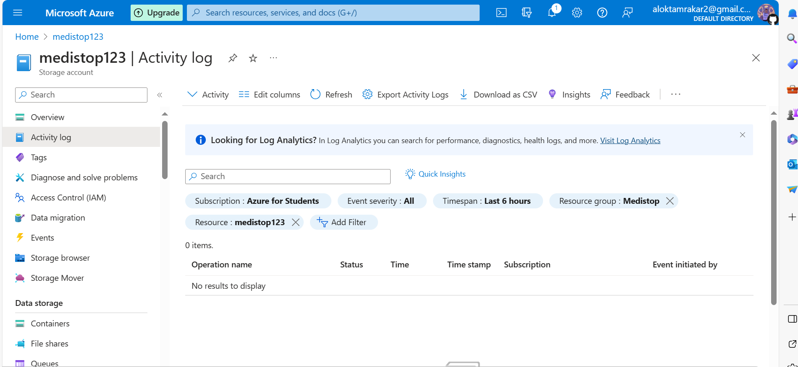
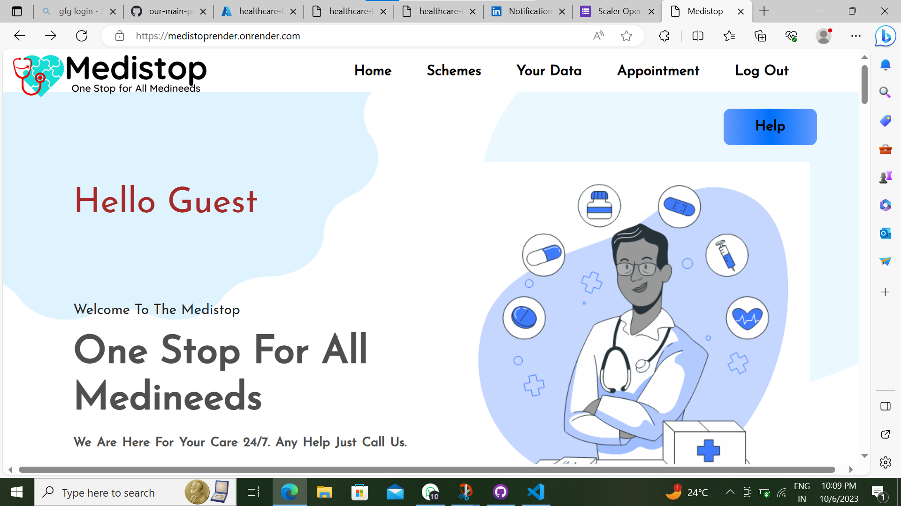
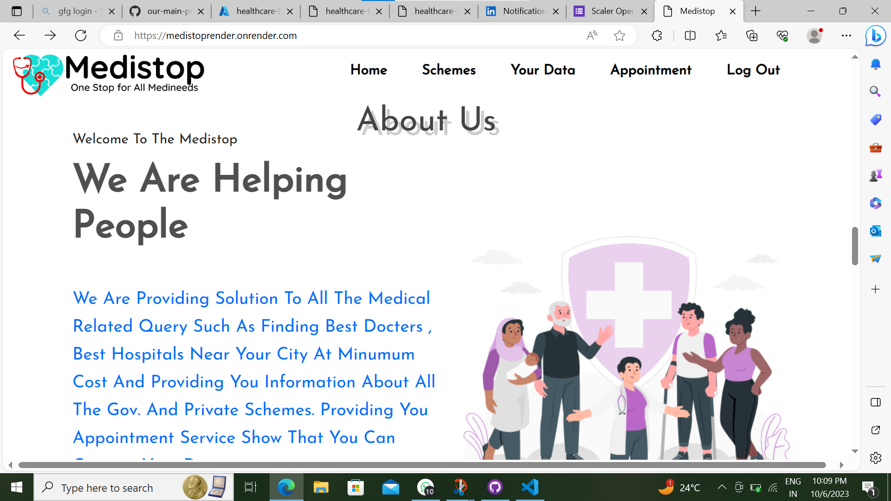
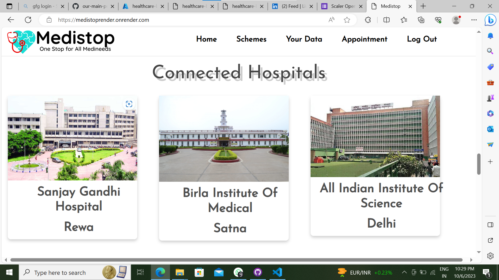
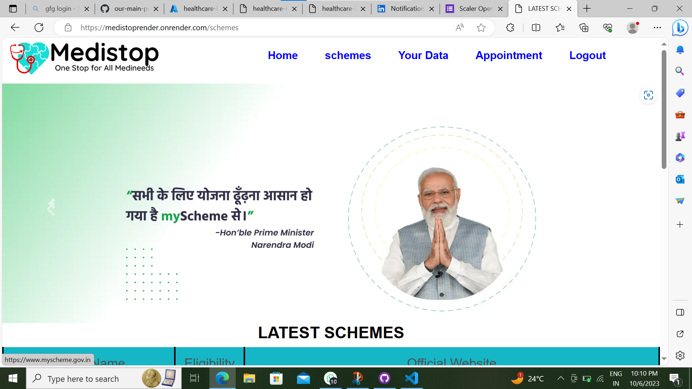
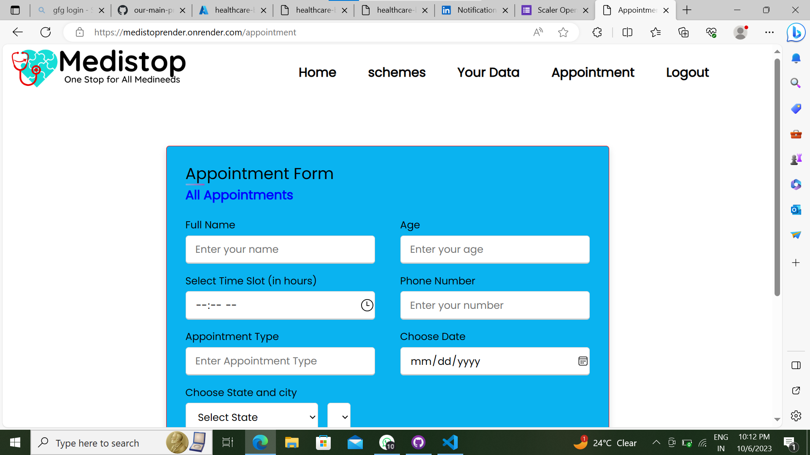
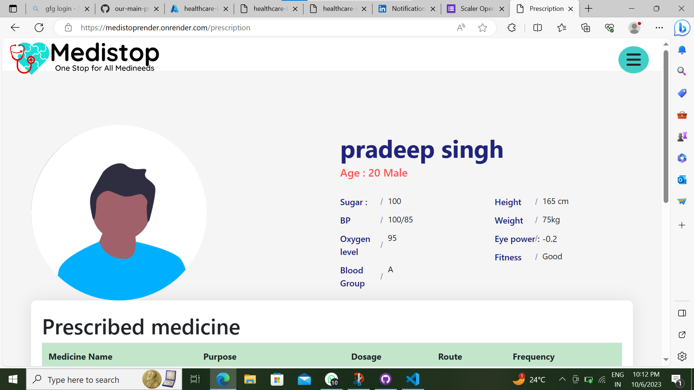
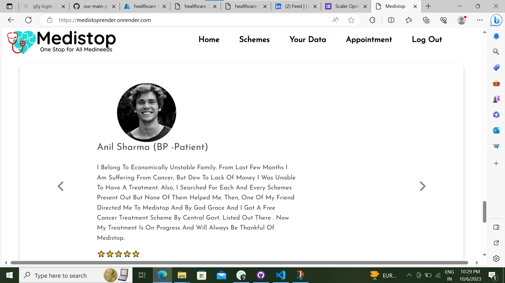
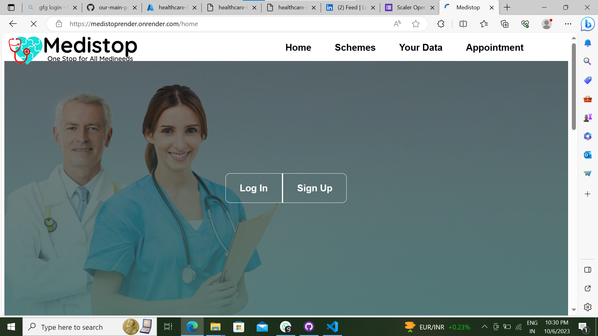

# Tumin - The Two Minute App
Tumin is a healthcare web app developed as a part of **Future Ready Talent Internship**. 
Tumin can be used as a med-tech tool that can ease your life with its various and crazy functionalities.

**Project Link:** 

**Project Demo Link:** 

 

## Key Features

- **Avinashak - The Healthcare Bot :** Tumin is packed with modern era chatbot developed using Azure Health Bot that can process your needs, navigate you through are website and most importantly can give you health related suggestions.
You can check your diabetes or can take health survey using the bot.

- **Medical Resources :** Tumin provides you with data about Healthcare centers, Hospitals and Doctors in your locality so you need to ask others at crucial time. Thus helps you finding right just in minutes.

- **Appointment System :** Tumin comes with Appointment System using which users can book the appointments with doctors and that even with their own preferred day and time slot. Gone the time when we need to sit in long queues for our number to come, now you have Tumin to do it all.

- **Schemes :** Tumin lists all the schemes, programs, NGO’s motives, and many more at one place to help economically weaker peopls to get the treatment for free or in as low cost as possible. This will help many to get the most optimum medical requirements and that even in lowest possible prices.

- **Personal Data :** Patients can store all there past history like medical certificates, report, medicinal information and many more in our website without any worry of losing anything. It will help you to find the documents whenever required without taking headache of missing them.

 

## Tech Stack
Tumin is smooth, sharp looking, and multi-fuctioning modern day website built to operate with ease. Tumin can work on multiple devices as well i.e. you can operate it with any device you have and that even without any bug and glitch.
Followinng technologies are used to built Tumin: 

- **Mongo Db :** Mongo DB is Database used to maintain user information and data realted to them. At Tumin, we used Mongo DB to store medical data and user information.

- **Express Js :** Express is a minimal and flexible Node.js web application framework that provides a robust set of features for web and mobile applications. This modern day framework is used to provide seamlessness to the webapp.

- **Node Js :** Node.js® is a JavaScript runtime built on Chrome's V8 JavaScript engine. We used it to create our server-side web application Tumin. It is used to provide the backend to the webapp.

- **Bootstrap :** Bootstrap is a free, open-source framework for creating websites and web applications. It's a collection of reusable code written in HTML, CSS, and JavaScript. Tumin uses Bootstrap to make website responsive and device friendly.

- **HTML :** HTML stands for Hypertext Markup Language. It's a markup language that's used to create web pages. HTML is the basic scripting language that web browsers use to render pages on the internet. 

- **CSS :** Cascading Style Sheets (CSS) is a coding language that describes how elements in a document should appear on screen, paper, or other media. It's a fundamental technology of the World Wide Web, along with HTML and JavaScript.

- **JavaScript :** JavaScript is a high-level, interpreted programming language. It is one of the three core technologies of the World Wide Web, along with HTML and CSS. JavaScript is used to make web pages interactive and to add dynamic content to web pages.

 

## Azure Technologies Used
- **Azure Static Web Apps**
- **Azure Bot Service**
- **Azure Health Bot Service**
- **Azure Storage**

 

## Breakdowns of Azure Technologies 📊:

## Azure Bot Service 🤖

- Avinashak a part of Tumin is totally built using Azure Health Bot Service.
- Avinashak comes with three functionalities:
-- d
- It is based on your bmi so this information may be true. 
- 
- It does not give accurate data.
- The chatbot is deployed using Azure App Service.

 
## Azure App Service 📱:

- I have used Azure App Service to deploy the chatbot.
- The chatbot is deployed as a web app, allowing it to be integrated into the medistop website.
- There are various app service plans like `Free`, `Standard` and `Premium` etc. I am using the free one to deploy my chatbot.

## Azure Blob Storage 🗄️

- Azure Blob Storage is used to store the knowledge base for the chatbot.
- I have created many containers to store the website images, chatbot images and the knowledge base files.

## Screen Shots of the Website
### Home Page

### About Page

### Schemes Page

### Appointment Page

### Your Data Page

### Testimonial Page
![image]

### Index page 

## Acknowledgements
I would like to express my sincere gratitude to Future Ready Talent, GitHub, and Microsoft Azure for providing me with the opportunity to work on this project.

##
Thank you for your interest in Medistop .
